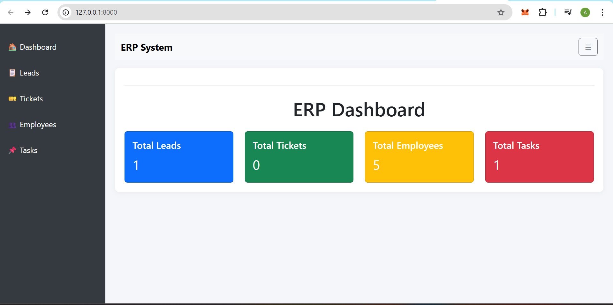
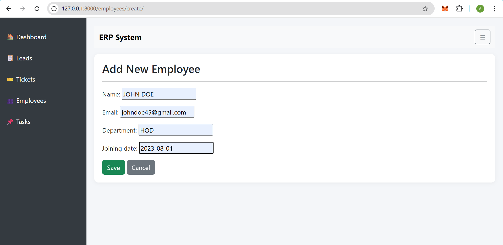
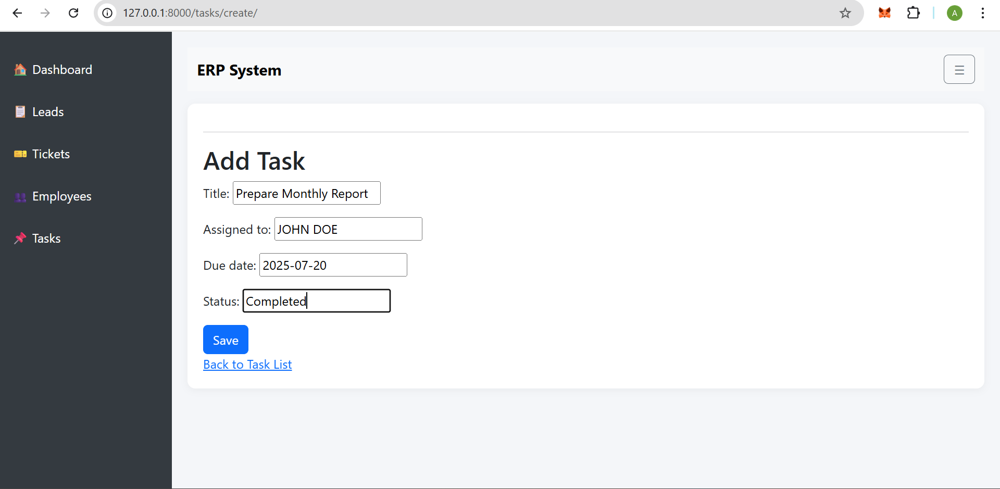
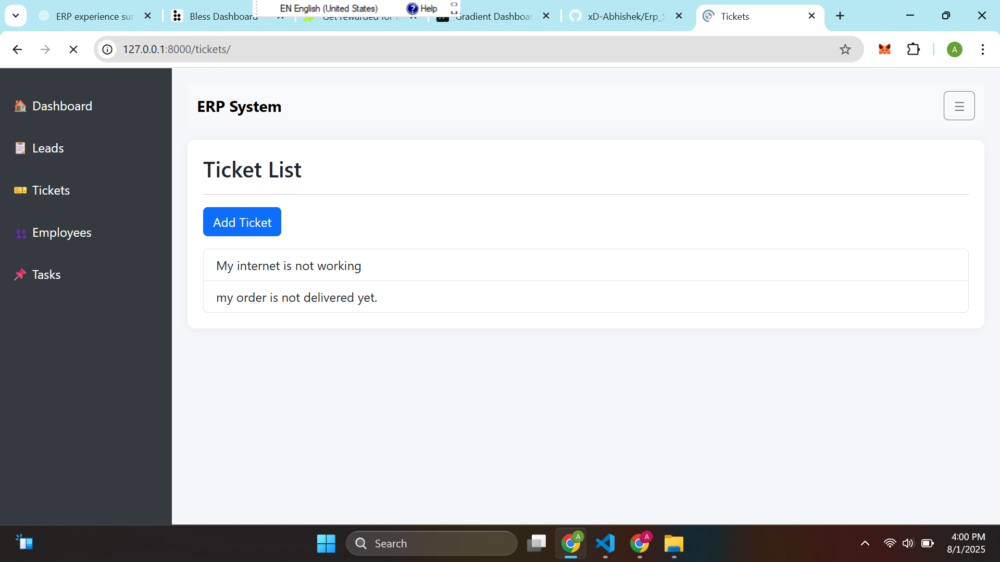
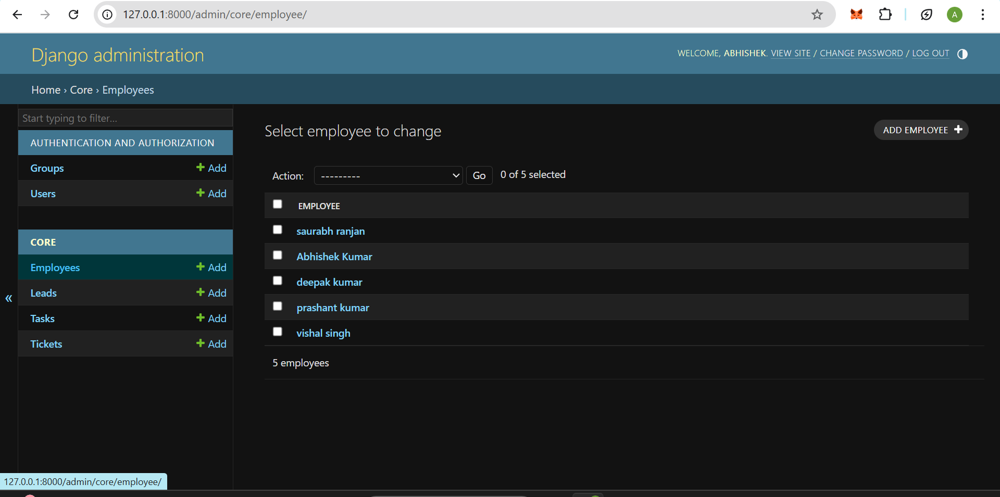

# ERP System (Django-based)

A basic ERP (Enterprise Resource Planning) web application built using Django. This system includes modules like Leads, Tickets, Tasks, and Employees. It allows users to create, read, update, and delete records efficiently through a simple UI.

## 🔧 Features

- 🧑‍💼 Lead Management (Create, View, Edit, Delete)
- 🎫 Ticket Management
- ✅ Task Assignment
- 👨‍👩‍👧‍👦 Employee Management
- 📁 Modular apps for each component
- 🧠 SQLite for data storage (default)
- 📄 Template-based HTML views

---
## 📁 Project Structure
```bash
erp_system/
├── employees/
├── lead/
├── tasks/
├── tickets/
├── erp_system/
│ └── settings.py
├── templates/
├── db.sqlite3
└── manage.py
```

Each app contains:
- `models.py`
- `views.py`
- `forms.py`
- `urls.py`
- `templates/<app_name>/`


## 🚀 Getting Started

### Prerequisites
- Python 3.8+
- Django 5.x
- Git (optional, for version control)

### Setup Instructions

1. **Clone the repo**
   ```bash
   git clone https://github.com/your-username/erp_system.git
   
   cd erp_system
   ```
2. **Create a virtual environment**
```bash
python -m venv venv
source venv/bin/activate  
```
**On Windows:**
```bash
venv\Scripts\activate
```
3. **Install dependencies**
```bash
pip install -r requirements.txt
```
4. **Apply migrations**
```bash
python manage.py makemigrations 
python manage.py migrate
```
5. **Run the development server**
```bash
python manage.py runserver
```
6. **Access the app**
```bash
http://127.0.0.1:8000/
```
## 📸 Screenshots

Here are some screenshots showcasing the functionality of the ERP System:

### 🔹 Dashboard View


### 🔹 Admin - Employee Management


### 🔹 Add Task Page


### 🔹 Submit Ticket Page


### 🔹 Admin Panel


## 🤝 Contributing
Pull requests are welcome. For major changes, please open an issue first to discuss what you would like to change.

## 📜 License
This project is open-source and free to use under the MIT License.

---
